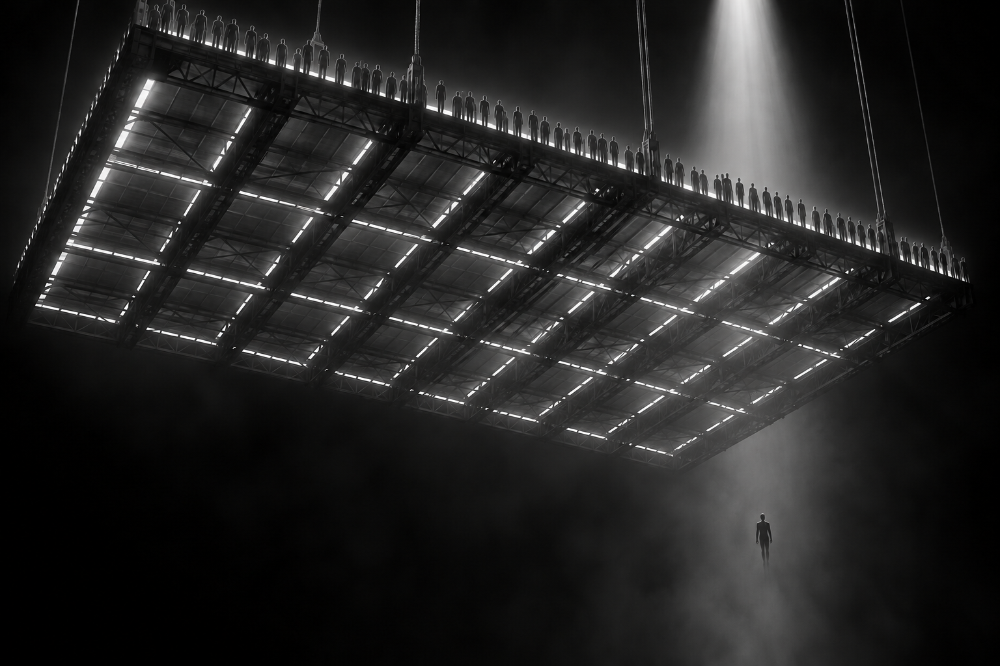
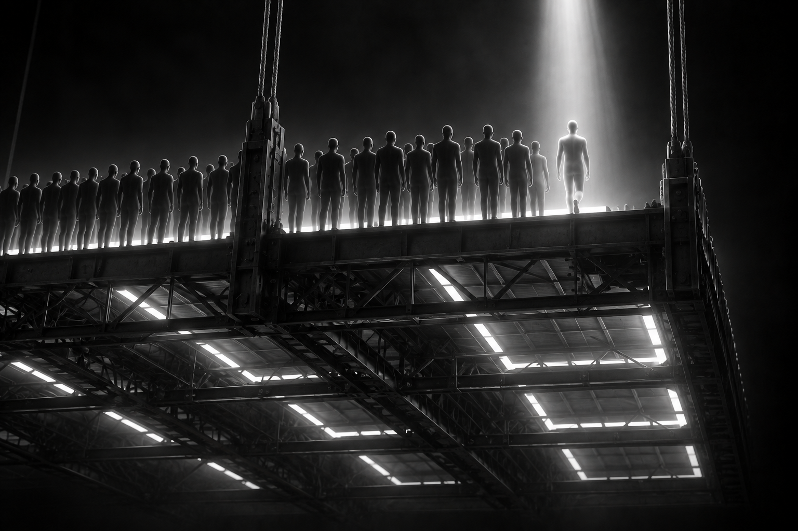
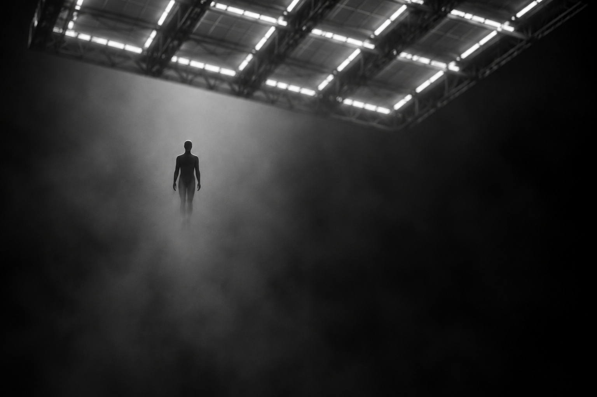
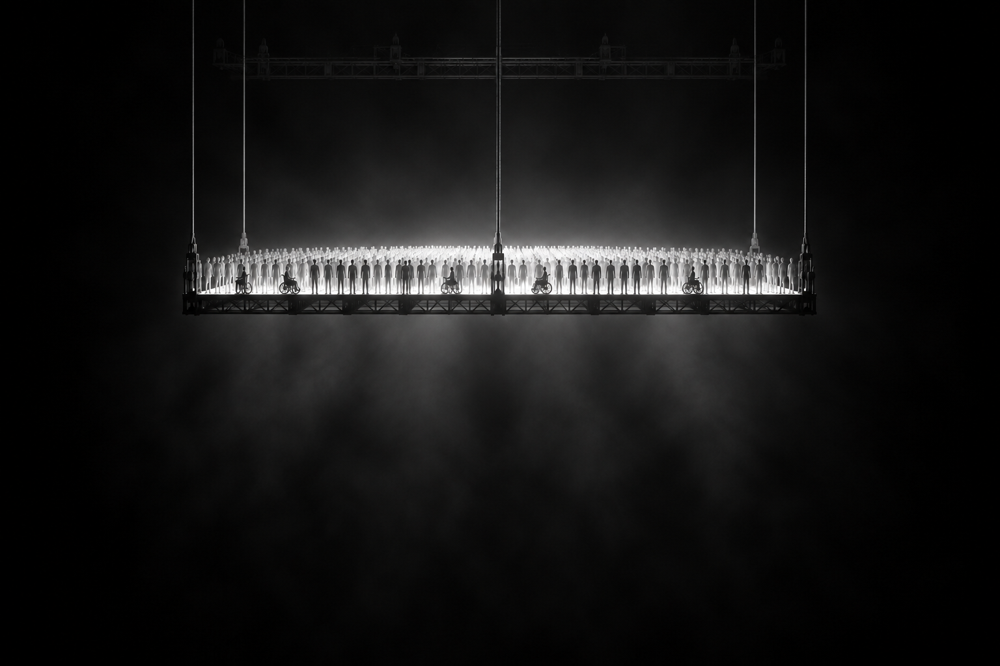
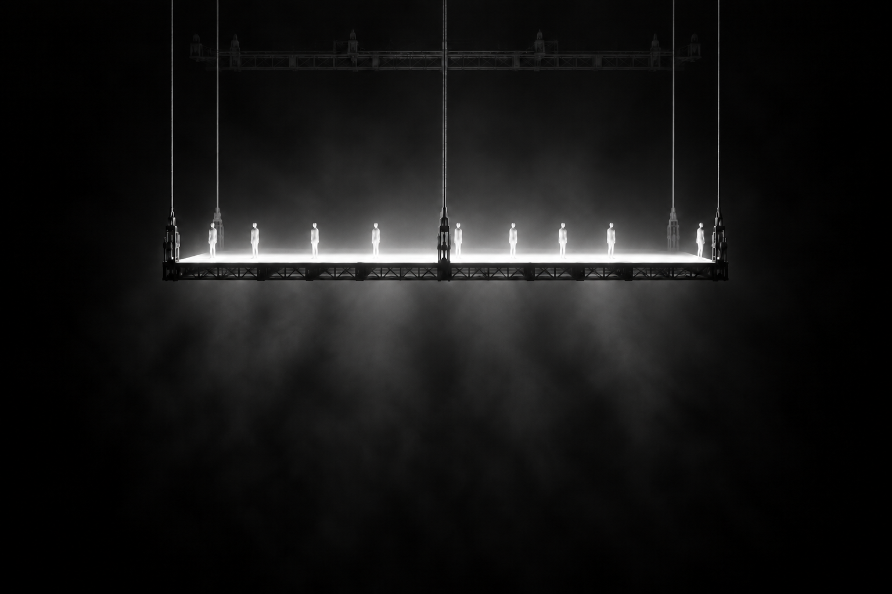
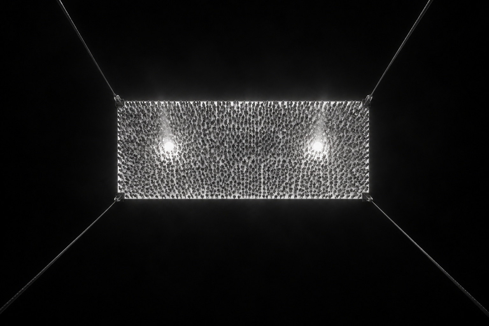

  

 

People are arriving. People are leaving. 
You are still here.
  
You could leave life right now.
  
Let that determine 
what you do and say and think.

enter

 

<h1 align="center">STILL HERE</h1>

<i>An art piece in two screens. Then nowhere else to go.</i>

 

---

## The piece

You open it. Black. A few lines of type arrive, one at a time. You press Enter.

Then you are underneath a slab of light hanging in the dark. People stand on it. New people are placed onto it from above. Others lose their light and fall through the floor into haze. You never see them land.

That is the whole website. No about page. No menu. Nowhere to go but here.

> *Each placement is a birth. Each fall is a death.*

That one line is the only explanation the piece ever gives.

  

## The rate

Right now, around the world, about **four people are born every second**. About **two die**.

The slab is always gaining people. Nobody needs a caption to feel it. It is slightly too full, like a house that keeps receiving guests. The dead are not here. **You are.**

  

## Three ways to look

The slab never changes shape. Japan and Nigeria, 1950 and 2085, stand on the same altar. What changes is how full it is.

<table>
  <tr>
    <td width="50%"></td>
    <td width="50%"></td>
  </tr>
  <tr>
    <td align="center"><b>LEVEL</b> · packed. A floor of people.</td>
    <td align="center"><b>LEVEL</b> · sparse. Air between bodies. You can count.</td>
  </tr>
  <tr>
    <td width="50%"></td>
    <td width="50%"></td>
  </tr>
  <tr>
    <td align="center"><b>ABOVE</b> · one rectangle of living matter.</td>
    <td align="center"><b>UNDER</b> · home. You are in the pit.</td>
  </tr>
</table>

## Laws

1. Two screens. A threshold, then the slab. Nowhere else.
2. Screen 1 does not explain. Screen 2 does not preach.
3. One slab. Never rebuilt into a map, a chart or a country outline.
4. No faces.
5. Births from above. Deaths through the floor. Nothing else happens to a body.
6. No ground in the pit.
7. At world speed, weather. Not six readable stories a second.
8. The interface is a caption, not a cockpit.
9. Default is now.
10. The name is **STILL HERE**. Use it like a sentence, not a brand.

## What it is not

Not a dashboard. Not a clock. Not a charity film. No counters, no scoreboard, no "births today so far." Counting is how you leave the present.

If you leave thinking about statistics, the piece failed.
If you leave thinking only about death, it leaned too far into the pit.
If you leave thinking *I'm still here*, it worked.

## Status

When the render stack changes, re-run `node tools/capture-still.mjs` and commit the updated WebP files under `public/stills/`.

**In progress.** This repository holds the art direction: the [original brief](docs/brief.md) and the reference stills in [`art/`](art/) that the piece is being built toward. The live, real-time version comes next, and its code will land here.

The stills are references, not the piece. They were made with image generation and art-directed by Dre.

## Colophon

Words on the threshold: Marcus Aurelius, *Meditations* 2.11.
Births and deaths: yearly figures from the UN World Population Prospects, spread across the seconds of the year. No individual is tracked. The "live" feeling is the year performed as a metronome.

 

© 2026 Dre. All rights reserved.

